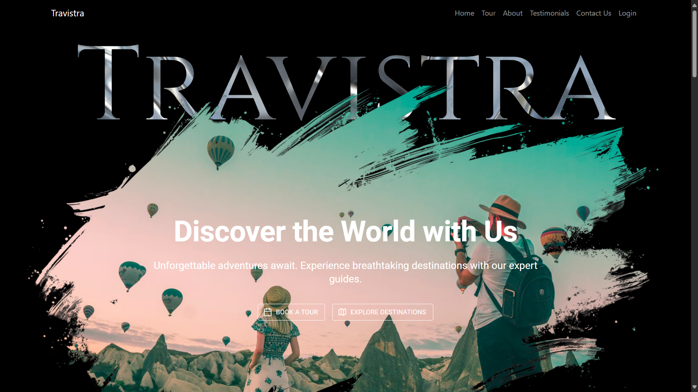
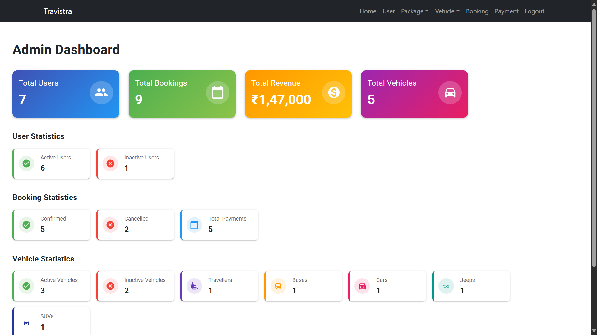
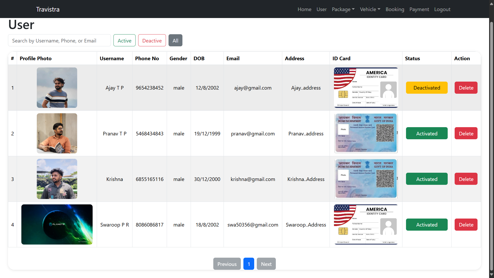
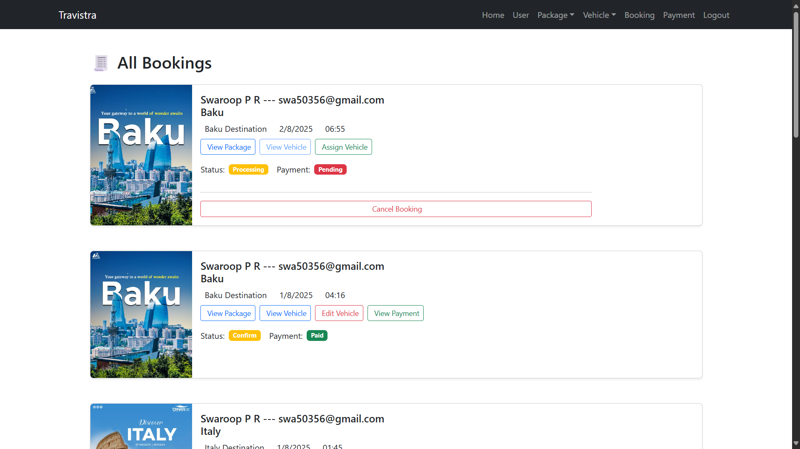
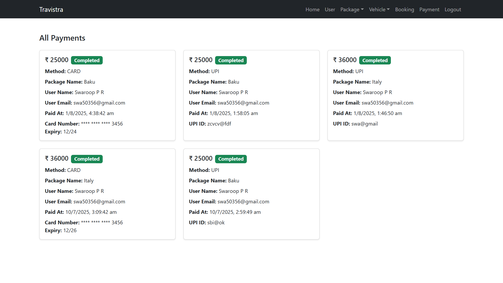
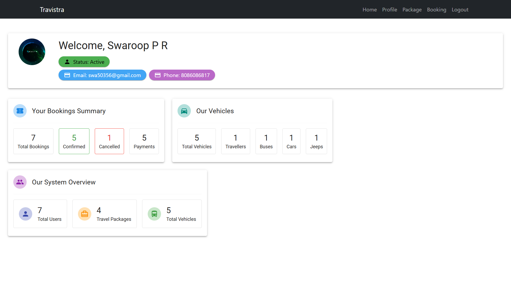
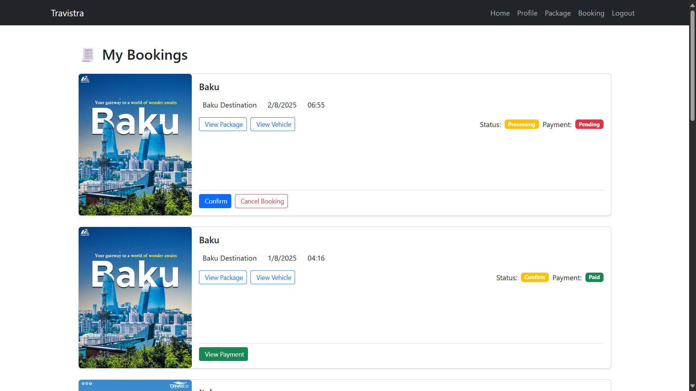
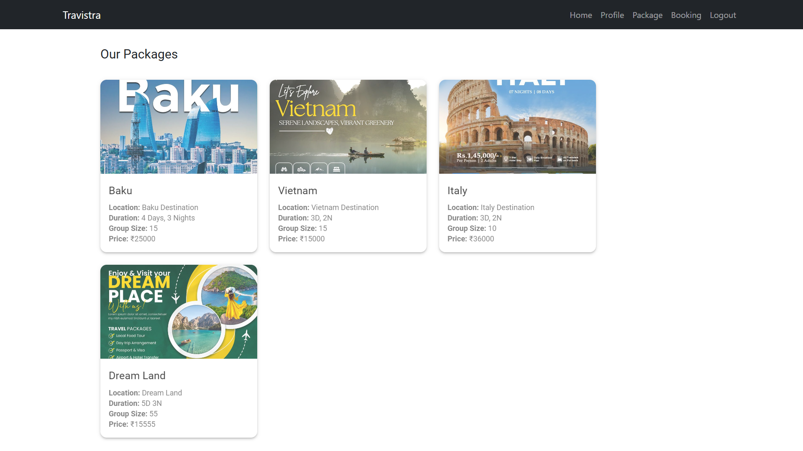

# Travistra

**Travistra** is a modern and responsive web application designed to simplify and enhance travel booking and management. With a sleek UI and robust backend, it offers an all-in-one solution for users to explore, plan, and book trips with ease.

🔗 **Live Demo**: [https://travistra-client.onrender.com](https://travistra-client.onrender.com)

## 🌟 Features

- 🧳 Browse curated travel packages  
- 📸 Upload and view travel images  
- 📅 Manage bookings with real-time updates  
- 👤 User profiles and secure authentication (JWT-based)  
- 🔐 Forgot Password functionality with Nodemailer  
- 📍 Destination details and itinerary overview  

## 🛠 Tech Stack

**Frontend**:
- React.js  
- Bootstrap  
- Material UI (MUI)  
- Framer Motion (animations)  
- LottieFiles (animated illustrations)  
- Axios (API calls)  

**Backend**:
- Node.js  
- Express.js  
- MongoDB  

**Other Tools**:
- JWT – For user authentication and session management  
- Multer – Handles image uploads and saves them locally  
- Dotenv – Manages environment variables securely  
- MongoDB Atlas – Cloud-hosted database for storing user and booking data  

## 📦 Installation

### 1. Clone the repository:
```bash
git clone https://github.com/swaroop-p-r/Travistra.git
```

### 2. Navigate to the project directory:
```bash
cd travistra
```

### 3. Install backend dependencies:
```bash
cd Server
npm install
```

### 4. Install frontend dependencies:
```bash
cd ../Client
npm install
```

### 5. Set up environment variables:  
Create a `.env` file in both the `Server/` and `Client/` directories.

**Server `.env` example:**
```ini
MONGO_URI=your_mongodb_atlas_uri
JWT_SECRET=your_jwt_secret
EMAIL_USER=your_email@example.com
EMAIL_PASS=your_email_password
```

**Client `.env` example:**
```ini
VITE_API_URL=http://localhost:4000
```

### 6. Start the development servers

**Start backend:**
```bash
cd Server
npm start
```

**Start frontend:**
```bash
cd ../Client
npm run dev
```

---

## 📷 Screenshots

### 🎬 Opening Screen  
[▶️ Watch Opening Video](./assets/openingShot.mp4)

---

### 🏠 Main Dashboard Screens

- **Home Page**  
  

---

### 👨‍💼 Admin Panel (Key Views)

- **Admin Dashboard**  
  

- **View Users**  
  

  - **View Bookings**  
  

- **View Payments**  
  

---

### 👤 User Panel (Key Views)

- **User Home**  
  

- **View Bookings**  
  

- **View Packages**  
  


---

## 📁 Folder Structure

```
Travistra/
├── Server/
│   ├── controllers/
│   ├── middleware/
│   ├── models/
│   ├── routes/
│   ├── uploads/
│   ├── utils/
│   ├── .env
│   └── index.js
│
├── Client/
│   ├── public/
│   ├── .env
│   └── src/
│       ├── components/
│       ├── pages/
│       └── App.js
│
├── README.md
├── assets/
```

---

## 📫 Contact

For any queries, feedback, or support:  
📧 swaroopxpr@gmail.com
